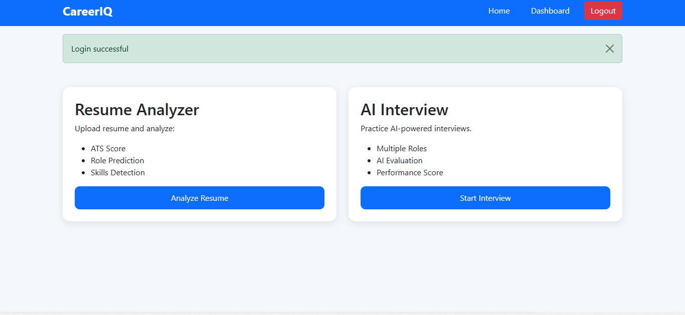
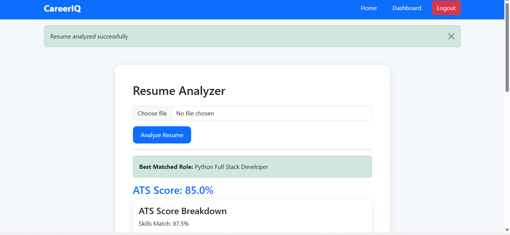
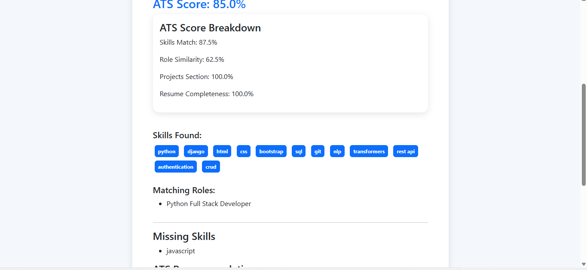
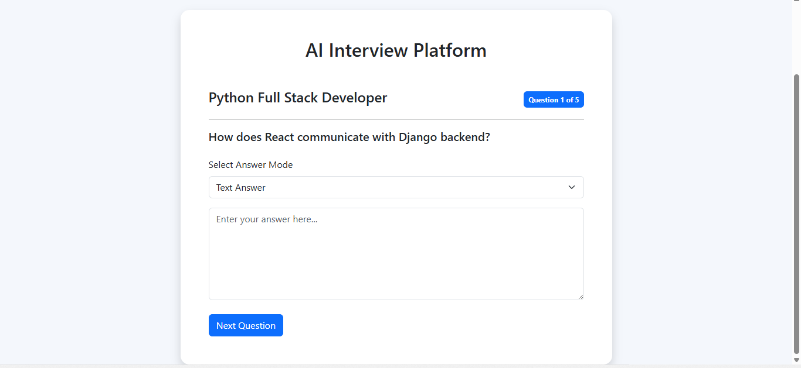
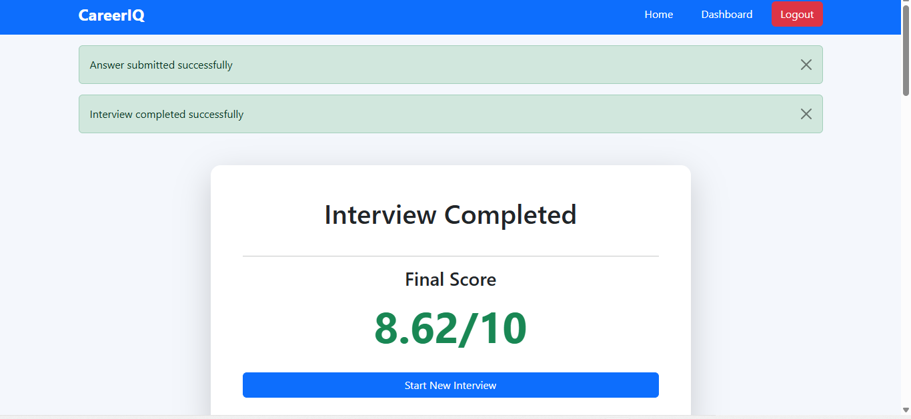
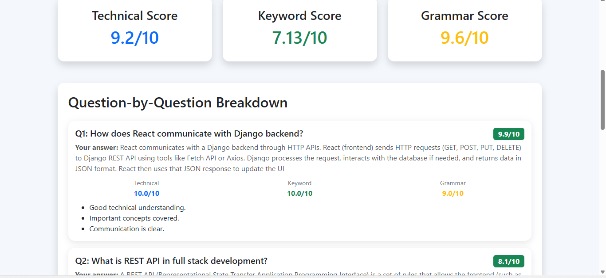
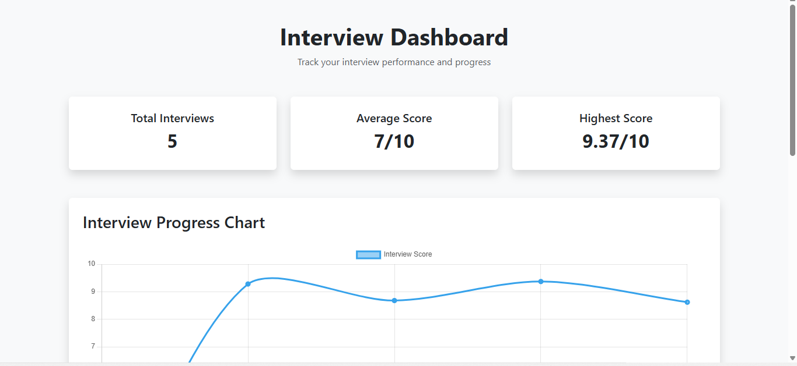
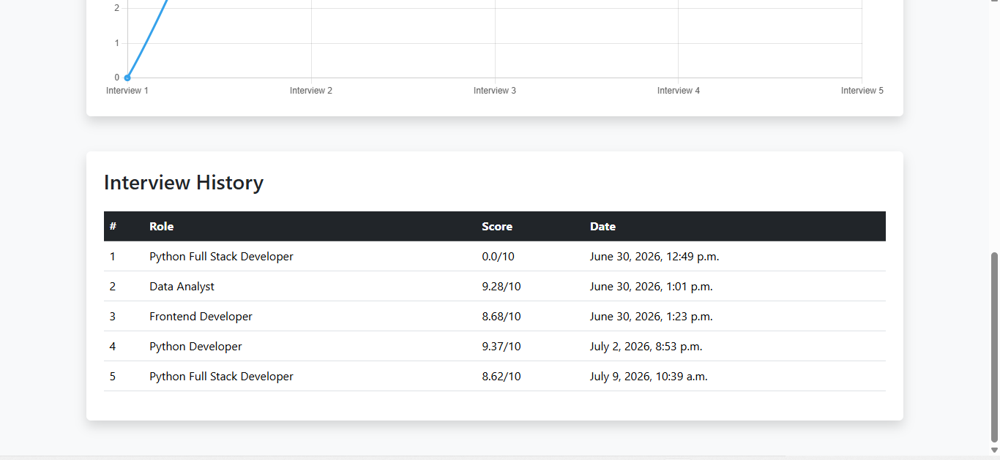

# CareerIQ — AI-Powered Resume & Interview Analysis System

CareerIQ analyzes a resume against 11 job roles using BERT-based semantic embeddings, predicts the best-fit role with an ATS compatibility score, and lets candidates practice role-specific mock interviews that are automatically scored on technical accuracy, keyword usage, and grammar.

**Live Demo:** [ai-interview-system-ccvs.onrender.com](https://ai-interview-system-ccvs.onrender.com)

> Note: hosted on Render's free tier — the app may take 30-50 seconds to wake up on first load.

---

## Screenshots

### Dashboard
Two core features, front and center: resume analysis and AI-powered mock interviews.


### Resume Analysis — ATS Score
Upload a resume and get an instant ATS compatibility score with a predicted best-fit role.


### ATS Score Breakdown
A transparent, component-level breakdown wiith skills matched, missing skills, and role similarity instead of a single opaque number.


### AI-Powered Mock Interview
Role-specific questions pulled from a curated bank across 11 roles and 3 difficulty levels.


### Final Interview Score
An aggregate score computed from semantic similarity, keyword coverage, and grammar quality.


### Detailed Score Breakdown
Every answer is scored individually across three dimensions, with feedback for each.


### Progress Dashboard
Interview history and score trends are tracked over time, not just per-session.



---

## Features

- **Resume parsing** — extracts raw text from uploaded PDFs and identifies skills from a 50-keyword library using word-boundary matching
- **ATS scoring** — a weighted 4-factor formula (keyword match 45%, semantic similarity 25%, project depth 20%, completeness 10%) scored against 11 predefined job roles, with automatic best-role prediction
- **Semantic matching** — resume and role-description text embedded using `all-MiniLM-L6-v2` (Sentence-BERT) and compared via cosine similarity
- **Dynamic interview generation** — 66 curated questions across 11 roles and 3 difficulty levels; each session samples 5 questions (2 easy / 2 medium / 1 hard) with no repeats
- **Automated answer scoring** — a 3-factor model (semantic similarity 60%, keyword coverage 30%, grammar 10%), including gibberish/low-effort answer detection
- **Progress tracking** — a dashboard showing interview history, average/highest scores, and a score trend chart over time
- **REST API** — a DRF-powered API layer exposing Resume, InterviewResult, Question, and Role resources, with per-user access control
- **Deployment** — hosted on Render with QR-code access for quick mobile testing

---

## Tech Stack

| Layer | Technology |
|---|---|
| Backend | Django 5.2, Django REST Framework |
| NLP / AI | Sentence-Transformers (`all-MiniLM-L6-v2`), scikit-learn, NLTK, TextBlob |
| Database | PostgreSQL |
| PDF Parsing | pdfplumber |
| Deployment | Render, Gunicorn, WhiteNoise |
| Frontend | Django templates, HTML/CSS |

---

## How the Scoring Works

**ATS Score** (per role, best match selected automatically):
```
final_score = (keyword_score × 0.45) + (semantic_score × 0.25)
            + (project_score × 0.20) + (completeness_score × 0.10)
```

**Interview Answer Score** (per question):
```
final_score = (semantic_score × 0.6) + (keyword_score × 0.3) + (grammar_score × 0.1)
```

Both formulas are intentionally interpretable such as every score can be traced back to a specific, explainable factor rather than a single opaque model output.

---

## Setup & Installation

```bash
# Clone the repo
git clone https://github.com/hkrns523-creator/ai-interview-system.git
cd ai-interview-system

# Create and activate a virtual environment
python -m venv venv
source venv/bin/activate        # Windows: venv\Scripts\activate

# Install dependencies
pip install -r requirements.txt

# Configure environment variables
cp .env.example .env
# then edit .env with your SECRET_KEY and database credentials

# Run migrations and load seed data
python manage.py migrate
python manage.py loaddata seed_data.json

# Start the development server
python manage.py runserver
```

The app expects a PostgreSQL database — update `DB_NAME`, `DB_USER`, `DB_PASSWORD`, `DB_HOST`, and `DB_PORT` in `.env` accordingly.

---

## API Endpoints

| Method | Endpoint | Description |
|---|---|---|
| GET | `/api/resumes/` | List resumes (own resumes, or all if staff) |
| GET | `/api/resumes/<id>/` | Retrieve a single resume |
| GET | `/api/resumes/<id>/score/` | Get ATS score breakdown for a resume |
| GET | `/api/interviews/` | List interview results |
| GET | `/api/interviews/role/<role>/` | Filter interview results by role |
| GET | `/api/questions/` | List questions (supports `?role=` and `?difficulty=` filters) |
| GET | `/api/roles/` | List all available job roles |

All endpoints require authentication; non-staff users are scoped to their own data.

---

## Known Limitations

- Skill extraction is regex/keyword-based rather than a trained NER model, so it can miss skills phrased differently than the exact keyword
- The interview questions are curated/static, not dynamically AI-generated but the "AI" is applied at the answer-scoring stage
- Grammar scoring uses rule-based heuristics (POS tagging, spelling correction, structural checks), not a deep grammar model
- In-progress interview state is stored in the Django session rather than persisted to the database, so an interrupted session cannot currently be resumed
- No automated test suite yet

---

## License

This project was built as a personal learning project. Feel free to explore the code for reference.
